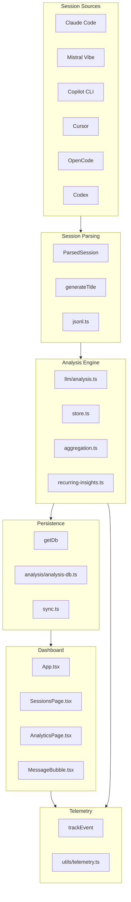

# Code-Insights Documentation

> Auto-generated from knowledge graph (graphify) on 2026-08-10

## Transformation Contract

This project transforms raw AI assistant session data into actionable insights through:
- **Input**: Session logs from Claude Code, Mistral Vibe, Copilot CLI, Cursor, OpenCode, Mistral Vibe, Codex, Copilot
- **Process**: Parse → Classify → Analyze → Store → Visualize
- **Output**: Insights, patterns, prompt quality scores, recurring themes, and optimization recommendations

## Key Concepts (God Nodes)

The knowledge graph identifies 10 core abstractions that form the backbone of this system:

| Rank | Node | Degree | Role | Community |
|------|------|--------|------|-----------|
| 1 | `cn()` | 112 | Utility function (React className helper) | UI Components |
| 2 | `getDb()` | 65 | Database connection singleton | Database |
| 3 | `trackEvent()` | 38 | Telemetry/analytics tracker | Telemetry |
| 4 | `ParsedSession` | 36 | Session data structure | Session Parsing |
| 5 | `Button()` | 34 | UI component factory | UI Components |
| 6 | `generateTitle()` | 29 | Session title generation | Session Parsing |
| 7 | `request()` | 29 | HTTP client function | LLM Client |
| 8 | `runInsightsCommand()` | 28 | CLI insights processing | CLI Commands |
| 9 | `SessionProvider` | 26 | React context provider | Session Management |
| 10 | `runMigrations()` | 25 | Database migration runner | Database |

## Architecture Overview

## Community Structure

The codebase is organized into 101 communities (modules). Top-level communities by node count:

1. **aggregation.ts** (92 nodes) - Insight aggregation and statistics
2. **Database Migration and Sync** (38 nodes) - Database operations and sync
3. **MessageBubble.tsx** (40 nodes) - Chat message UI components
4. **LlmProviderCard.tsx** (39 nodes) - LLM provider configuration UI
5. **Agent Rules and Metadata** (33 nodes) - Agent configuration parsing
6. **cli/src/index.ts** (29 nodes) - CLI entry point and commands
7. **share-card-utils.ts** (41 nodes) - Social sharing functionality
8. **SessionDetailPanel.tsx** (36 nodes) - Session detail view
9. **copilot-cli.ts** (9 nodes) - Copilot CLI integration
10. **Prompt Optimization Engine** (34 nodes) - Prompt optimization logic

## Surprising Connections

The graph reveals non-obvious dependencies:

- `initTestDb()` → `runMigrations()`: Test initialization triggers migrations
- `markInsightStale()` → `getDb()`: Stale marking uses database singleton
- `getSessionAnalysisUsage()` → `getDb()`: Usage tracking via database
- `InsightsCommandOptions` → `AnalysisRunner`: CLI options reference runner types
- `TeammateMessageCard()` → `cn()`: UI component uses className utility

## Import Cycles

None detected. The codebase has no circular dependencies.

## Knowledge Gaps

- **357 isolated nodes** with ≤1 connection - possible missing edges or undocumented components
- **12 thin communities** (<3 nodes) omitted from report

## Quick Links

- [Architecture](architecture.md) - Component relationships and data flow
- [Data Flow](data-flow.md) - Sequence diagram of primary operations
- [Decisions](decisions.md) - Design rationale and trade-offs
- [Modules](./modules/) - Per-module documentation

---

*Generated by graphify + codebase-mapper. Last updated: 2026-08-10*
