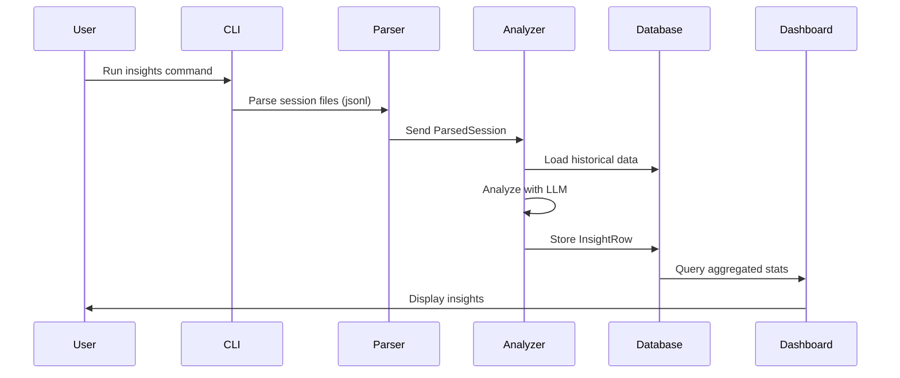
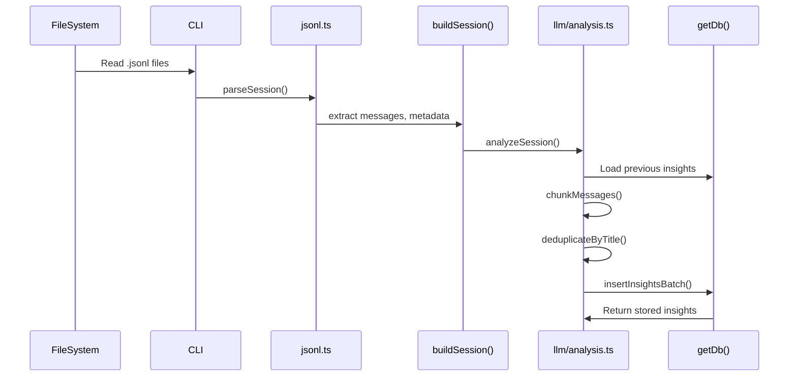
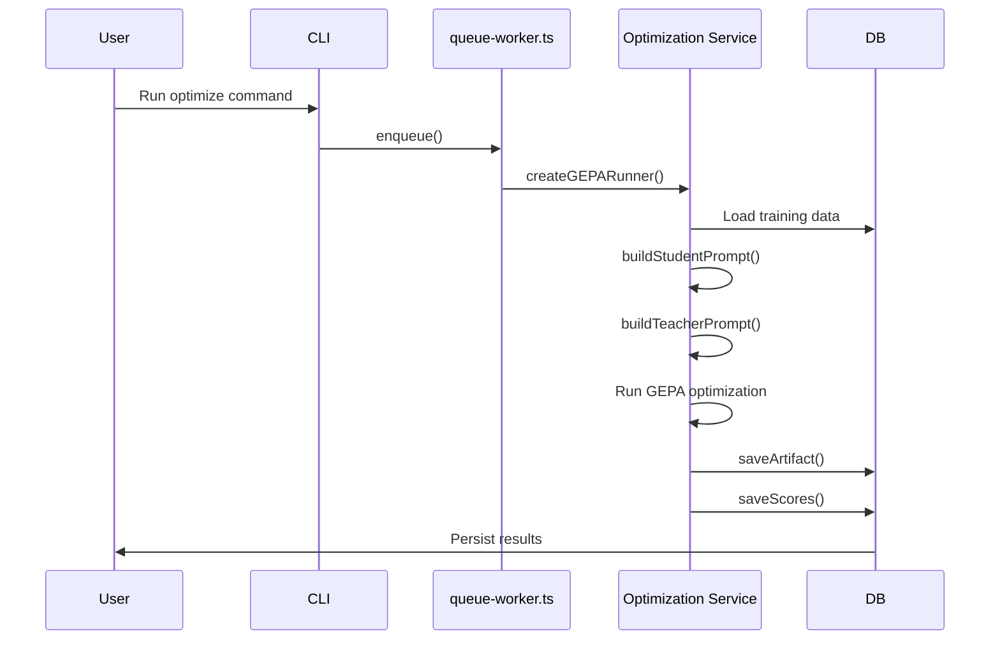

# Architecture

> Component relationships, data flow pipeline, and design rationale

## Component Relationship Map

```mermaid
flowchart TD
    %% Layer 1: CLI Entry Points
    CLI[("CLI")] -->|commands| CLI_Commands
    CLI_Commands[("cli/src/index.ts")] -->|dashboard| DashboardCmd
    CLI_Commands -->|init| InitCmd
    CLI_Commands -->|insights| InsightsCmd
    CLI_Commands -->|reflect| ReflectCmd
    CLI_Commands -->|sync| SyncCmd
    CLI_Commands -->|export| ExportCmd
    
    %% Layer 2: Server
    Server[("server/src/index.ts")] -->|API routes| Routes
    Routes -->|/api/analysis| AnalysisRoutes
    Routes -->|/api/insights| InsightsRoutes
    Routes -->|/api/queue| QueueRoutes
    Routes -->|/api/reflect| ReflectRoutes
    
    %% Layer 3: Core Services
    Services[("Core Services")] -->|LLM Client| LLMClient
    Services -->|Database| getDb
    Services -->|Telemetry| trackEvent
    Services -->|Config| utils/config.ts
    
    %% Layer 4: Analysis Engine
    AnalysisEngine[("Analysis Engine")] -->|llm/analysis.ts| SessionAnalyzer
    AnalysisEngine -->|store.ts| InsightStore
    AnalysisEngine -->|aggregation.ts| Aggregator
    AnalysisEngine -->|recurring-insights.ts| RecurringDetector
    
    %% Layer 5: Parsing
    Parsing[("Parsing Layer")] -->|jsonl.ts| SessionParser
    Parsing -->|ParsedSession| SessionStructure
    Parsing -->|generateTitle| TitleGenerator
    Parsing -->|registry.ts| ProviderRegistry
    Parsing -->|copilot-cli.ts| CopilotParser
    Parsing -->|cursor.ts| CursorParser
    Parsing -->|mistral-vibe.ts| MistralVibeParser
    Parsing -->|codex.ts| CodexParser
    
    %% Layer 6: Database
    Database[("Database Layer")] -->|analysis/analysis-db.ts| AnalysisDB
    Database -->|analysis/analysis-usage-db.ts| UsageDB
    Database -->|sync.ts| SyncManager
    Database -->|migrate.ts| MigrationRunner
    
    %% Layer 7: UI Dashboard
    UI[("Dashboard")] -->|App.tsx| MainApp
    UI -->|SessionsPage.tsx| SessionsView
    UI -->|SessionDetailPanel.tsx| SessionDetail
    UI -->|AnalyticsPage.tsx| AnalyticsView
    UI -->|PatternsPage.tsx| PatternsView
    UI -->|ChatConversation.tsx| ChatView
    UI -->|PromptQualityCard.tsx| QualityView
    
    %% Connections
    CLI_Commands --> Services
    CLI_Commands --> Parsing
    CLI_Commands --> AnalysisEngine
    Server --> AnalysisEngine
    Server --> Database
    AnalysisEngine --> Database
    AnalysisEngine --> Services
    Parsing --> Database
    Parsing --> Services
    UI --> Services
    
    %% Styling
    classDef god fill:#f59e0b,stroke:#d97706,color:#000,font-weight:bold
    class getDb,cn,ParsedSession god
```

## Data Flow Pipeline

The primary data pipeline follows this sequence:

### Detailed Session Processing Flow

### Prompt Optimization Flow

## Design Rationale

### Why `getDb()` is a Singleton

The `getDb()` function (65 edges, rank #2) acts as a central database connection manager. Its high betweenness centrality (0.040) makes it a critical cross-community bridge, connecting:

- Database Migration and Sync
- analysis/analysis-db.ts
- session-end.ts
- runInsightsCommand
- cli/src/index.ts
- Analysis Usage Database
- Prompt Optimization Engine
- store.ts
- commands/insights.ts
- sync.ts

This pattern ensures consistent database connections across the entire application, preventing connection leaks and enabling transaction management.

### Why `cn()` is Ubiquitous

The `cn()` utility (112 edges, rank #1) is a Tailwind CSS className merger used throughout the React UI. It connects to 14 different communities including:

- MessageBubble.tsx
- ChatConversation.tsx
- SessionsPage.tsx
- SessionDetailPanel.tsx
- PromptQualityCard.tsx
- App.tsx
- AnalyticsPage.tsx
- lib/types.ts
- lib/utils.ts
- AnalysisCostLine.tsx

This high connectivity reflects the unified styling approach across the dashboard.

### Why `ParsedSession` is a Bridge

`ParsedSession` (36 edges, rank #4) acts as the central data structure connecting:

- src/types.ts (type definitions)
- Database Migration and Sync
- copilot-cli.ts
- cursor.ts
- mistral-vibe.ts
- getDb
- registry.ts
- OpenCode Provider Integration
- generateTitle
- jsonl.ts
- copilot.ts
- codex.ts

This bridge pattern enables the system to handle diverse session formats from multiple AI assistants uniformly.

## Module Boundaries

| Module | Responsibility | Key Files |
|--------|---------------|-----------|
| **CLI** | Command-line interface | cli/src/index.ts, commands/*.ts |
| **Server** | HTTP API | server/src/index.ts, routes/*.ts |
| **Parsing** | Session file parsing | jsonl.ts, registry.ts, parsers/*.ts |
| **Analysis** | Insight extraction | llm/analysis.ts, store.ts, aggregation.ts |
| **Database** | Data persistence | analysis-db.ts, sync.ts, migrate.ts, client.ts |
| **UI** | User interface | App.tsx, SessionsPage.tsx, AnalyticsPage.tsx |
| **LLM** | LLM integration | llm/*, providers/*.ts |
| **Telemetry** | Usage tracking | utils/telemetry.ts |
| **Optimization** | Prompt optimization | queue-worker.ts, optimization/*.ts |

## Cross-Cutting Concerns

### Multi-Provider Support

The system supports multiple AI assistant providers:
- Claude Code
- Mistral Vibe
- Copilot CLI
- Cursor
- OpenCode
- Codex
- Copilot (VS Code)

Each provider has its own parser module that normalizes session data into the common `ParsedSession` format.

### Pluggable LLM Clients

The LLM Client Factory (`createClientFromConfig()`) supports:
- Anthropic
- Gemini
- Mistral
- Ollama
- Custom providers

This enables users to select their preferred LLM for analysis tasks.

### Rate Limiting

The `LLM Client Factory` includes `initRateLimiterFromConfig()` to prevent API rate limit issues, with configurable limits per provider.

---

*Generated by graphify + codebase-mapper. Last updated: 2026-08-10*
