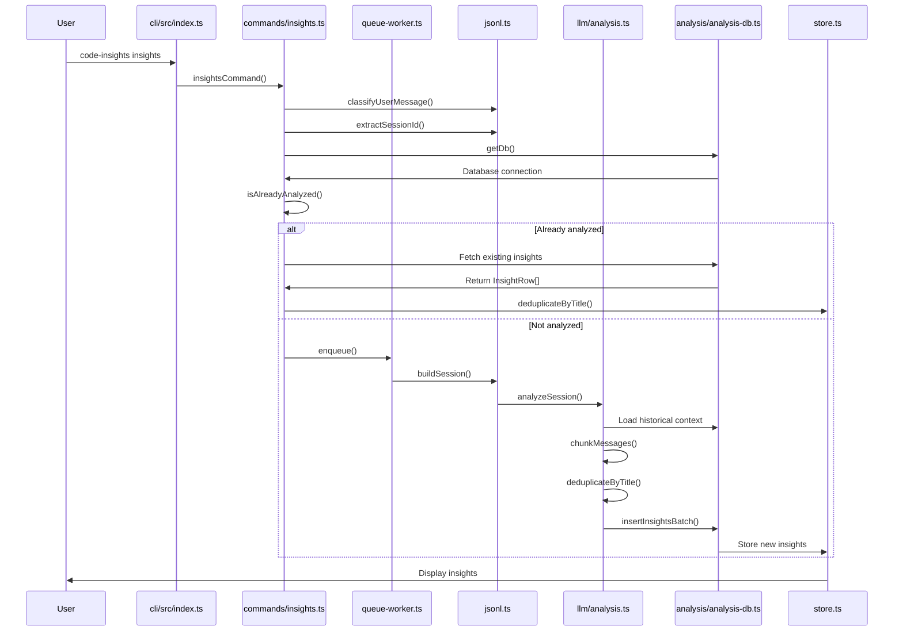
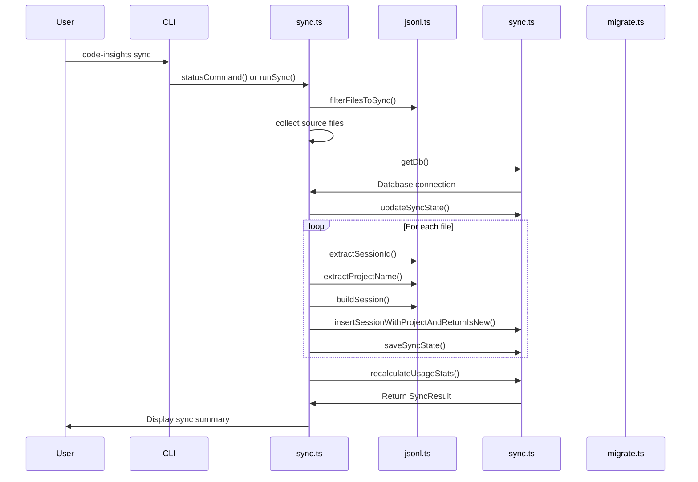
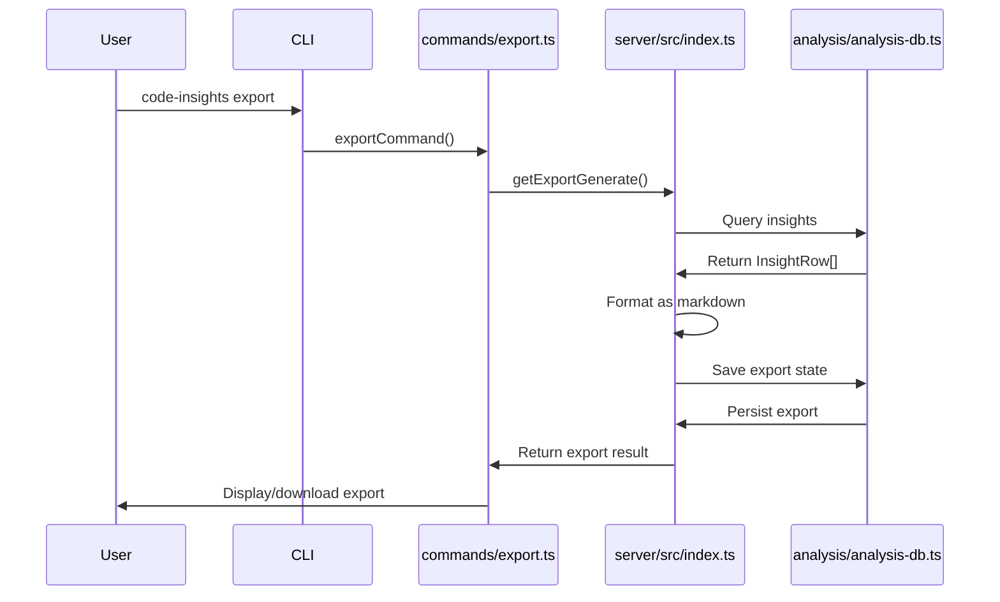
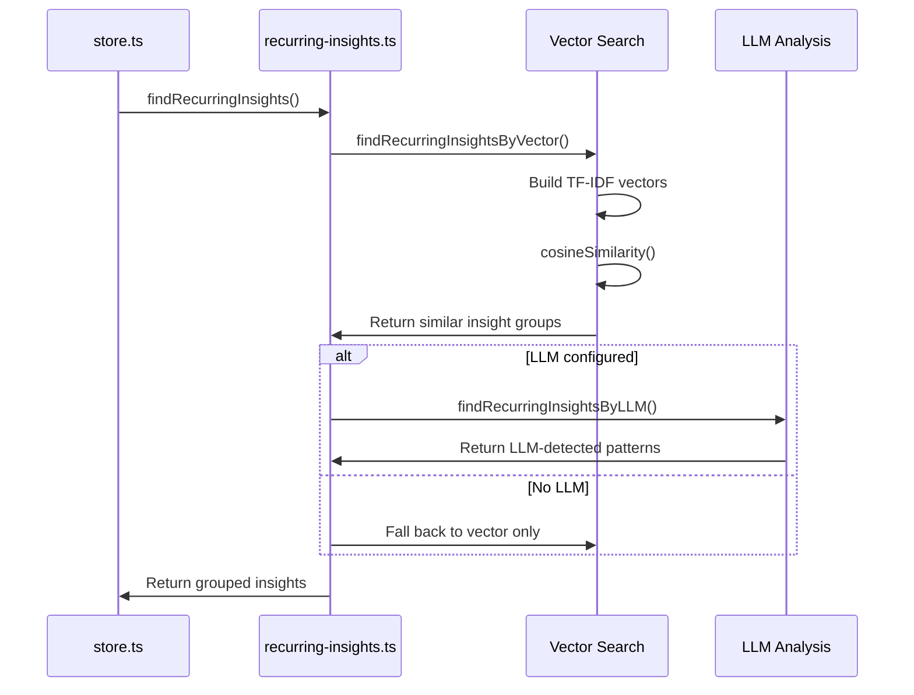
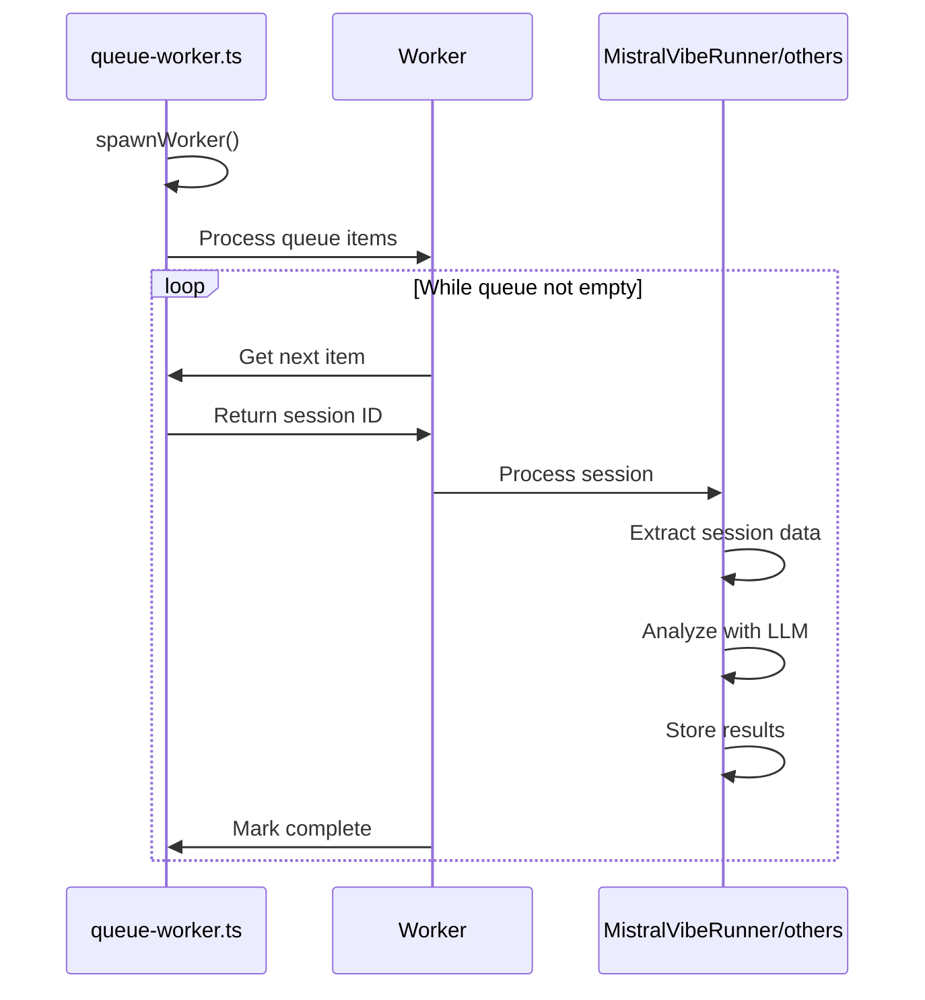
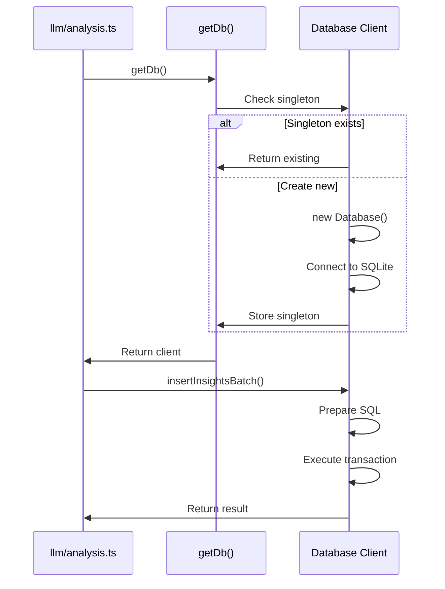
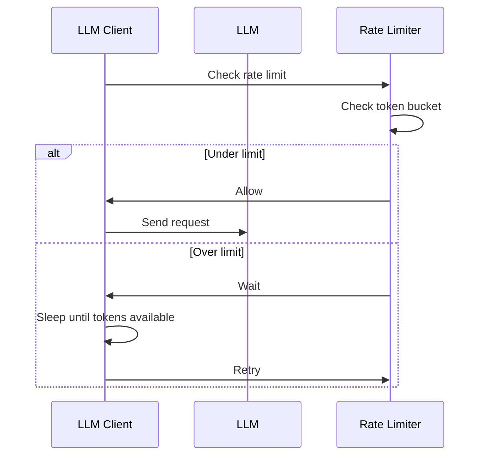
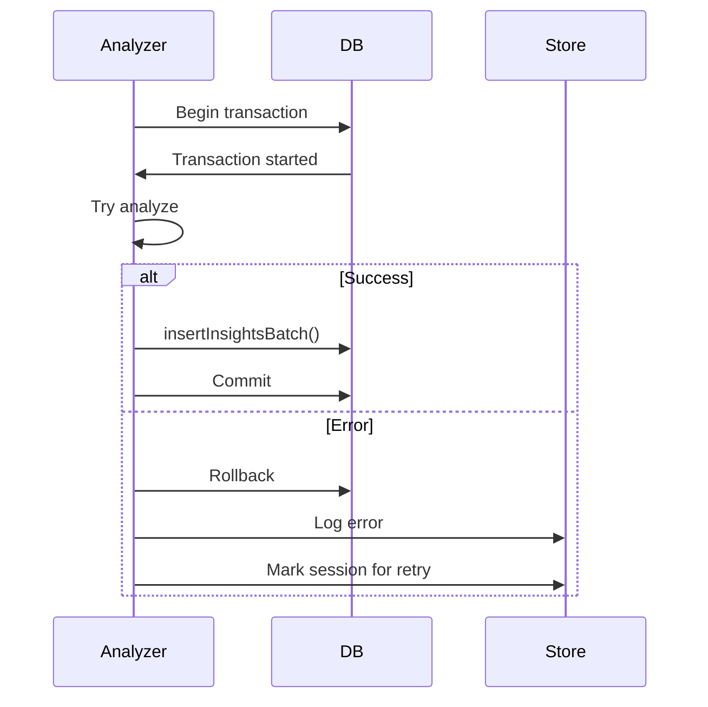

# Data Flow

> Sequence diagrams and data transformation patterns

## Primary Operations

### Insights Generation Flow



### Session Sync Flow



### Export Generation Flow



## Data Transformation Patterns

### Session → ParsedSession

```
Input: Raw session JSONL file
┌─────────────────────────────────────────────────────────┐
│ {                                                    │
│   "id": "session-123",                             │
│   "messages": [...],                                 │
│   "metadata": {                                     │
│     "provider": "claude-code",                      │
│     "timestamp": "2026-08-10T00:00:00Z",           │
│     "project": "my-project"                         │
│   }                                                   │
│ }                                                    │
└─────────────────────────────────────────────────────────┘
                           ↓
┌─────────────────────────────────────────────────────────┐
│ ParsedSession (jsonl.ts → buildSession)              │
│ {                                                    │
│   sessionId: string,                                 │
│   provider: ProviderType,                            │
│   projectName: string,                               │
│   messages: ParsedMessage[],                         │
│   metadata: SessionMeta,                             │
│   timestamp: Date,                                   │
│   character: string                                  │
│ }                                                    │
└─────────────────────────────────────────────────────────┘
                           ↓
┌─────────────────────────────────────────────────────────┐
│ InsightRow (store.ts → analysis)                    │
│ {                                                    │
│   sessionId: string,                                 │
│   title: string,                                     │
│   type: InsightType,                                 │
│   content: string,                                   │
│   evidence: string[],                                │
│   categories: string[],                              │
│   actionable: boolean,                               │
│   confidence: number,                                │
│   ...                                                │
│ }                                                    │
└─────────────────────────────────────────────────────────┘
```

### Message Chunking for Analysis

```
Full Session Messages
┌─────────────────────────────────────────────────────────┐
│ [msg1, msg2, msg3, ..., msgN]                          │
└─────────────────────────────────────────────────────────┘
                           ↓
┌─────────────────────────────────────────────────────────┐
│ chunkMessages() splits by:                             │
│ - Code blocks (preserved whole)                         │
│ - User/AI message boundaries                            │
│ - Token limits (~4000 tokens per chunk)                │
└─────────────────────────────────────────────────────────┘
                           ↓
┌─────────────────────────────────────────────────────────┐
│ [chunk1, chunk2, chunk3]                              │
│ Each chunk sent to LLM for analysis                    │
└─────────────────────────────────────────────────────────┘
```

### Deduplication Strategy

```
Input: Raw LLM analysis results
┌─────────────────────────────────────────────────────────┐
│ [insight1, insight2, insight3, ...]                      │
│   - Some may be duplicates                               │
│   - Some may be near-duplicates (similar titles)          │
└─────────────────────────────────────────────────────────┘
                           ↓
┌─────────────────────────────────────────────────────────┐
│ deduplicateByTitle() (store.ts)                         │
│ - Normalize titles (trim, lowercase)                     │
│ - Use Levenshtein distance for similarity                │
│ - Keep first occurrence, merge evidence                 │
└─────────────────────────────────────────────────────────┘
                           ↓
┌─────────────────────────────────────────────────────────┐
│ Deduplicated insights stored in database                  │
└─────────────────────────────────────────────────────────┘
```

## Recurring Insights Detection



### Vector Similarity Flow

```
Input: N insights with content
┌─────────────────────────────────────────────────────────┐
│ For each insight:                                       │
│   1. Tokenize content                                    │
│   2. Build TF-IDF vector                                 │
│   3. Normalize vector                                   │
└─────────────────────────────────────────────────────────┘
                           ↓
┌─────────────────────────────────────────────────────────┐
│ Compare all pairs:                                      │
│   dotProduct(vecA, vecB)                                 │
│   cosineSimilarity(vecA, vecB)                           │
└─────────────────────────────────────────────────────────┘
                           ↓
┌─────────────────────────────────────────────────────────┐
│ Group insights with similarity > threshold (0.7)           │
│ Each group = recurring insight theme                     │
└─────────────────────────────────────────────────────────┘
```

## Queue Processing Flow



## Database Write Flow



## Error Handling Flows

### Rate Limit Handling



### Analysis Error Handling



---

*Generated by graphify + codebase-mapper. Last updated: 2026-08-10*
