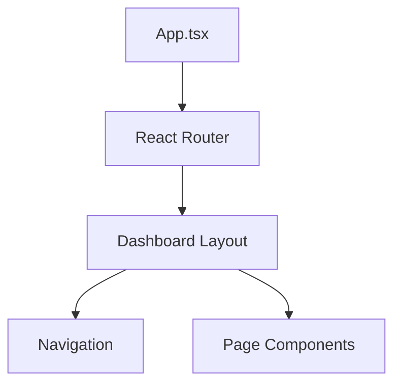
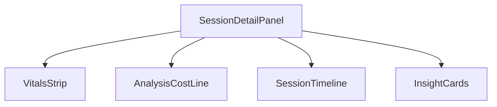
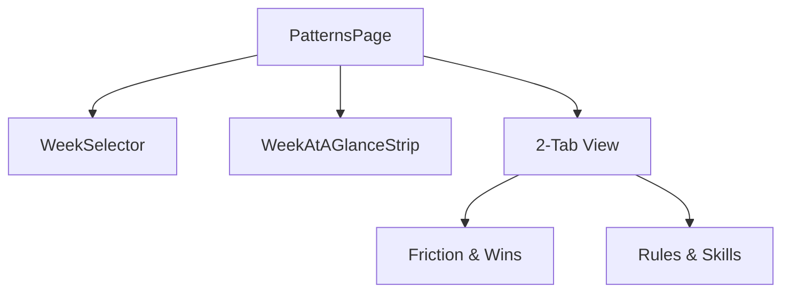
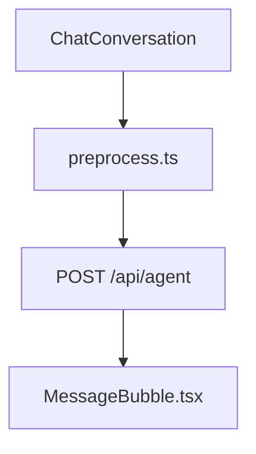

# Dashboard UI Component Architecture

> Component architecture, state management, and interaction flow for the Code Insights Dashboard. Linked from [Architecture](../architecture.md).

## Core Application Structure

The Dashboard is a React SPA built with Vite, TypeScript, and Tailwind CSS, featuring standard components from `shadcn/ui`.

## Key Views & Component Trees

### Session Detail Panel (`SessionDetailPanel.tsx`)

The `SessionDetailPanel` acts as the primary analytical view for a given AI session.

- **`SessionDetailPanel`**: Container component that orchestrates data fetching (`useSession`) and state for a single session.
- **`VitalsStrip`**: Displays high-level session metrics (Duration, Prompts, Turn Count, AI Fluency Score) in a horizontal badge format.
- **`AnalysisCostLine`**: Visualizes token consumption and LLM API cost using `useAnalysisUsage` to provide per-session economic visibility.

### Patterns Page (`PatternsPage.tsx`)

Cross-session synthesis for uncovering larger trends.

- **Threshold Gates**: Requires a minimum number of valid sessions before generating weekly patterns to avoid low-confidence outputs.
- **SSE Streaming**: Generates patterns in real-time, streaming text to the UI as it reflects on the week's data.
- **`WeekAtAGlanceStrip`**: A concise summary of the week's overall characteristics, used as the primary source for generating social sharing cards (`share-card-utils.ts`).

### Journal Page (`JournalPage.tsx`)

Chronological timeline of insights.

- Integrates `useInsights` for fetching parsed insights.
- Utilizes `date-fns` to intelligently group and format learnings, decisions, and outcomes by ISO week.
- Supports detailed timeline filtering.

### Chat Subsystem (`ChatConversation.tsx`)

A unified chat interface for deep dives into session data.

- **`preprocess.ts`**: Sanitizes and structures user inputs, ensuring context references are cleanly parsed before they hit the LLM.
- **`POST /api/agent`**: Receives preprocessed input. Handles strict schema validation and responds with standard RLM (Run Language Model) responses.
- **`MessageBubble.tsx`**: Rich rendering for chat responses. Interprets structured outputs like tool calls, code diffs, or markdown tables.

## State Management

- **React Query**: Handles all server interactions (`useSessions`, `useAnalysisQueue`, `useInsights`). Caches are intelligently invalidated (e.g., when the Analysis Queue drains).
- **Context API**: For global theme and settings management.
