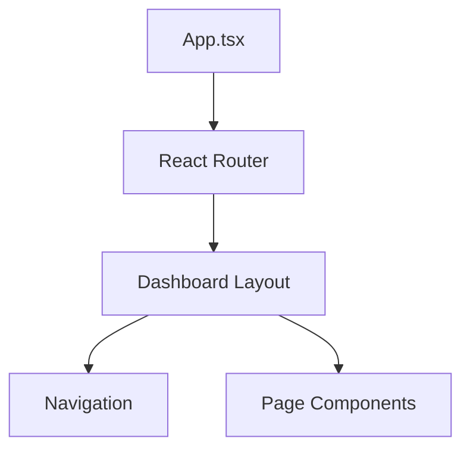
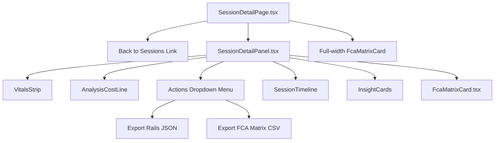
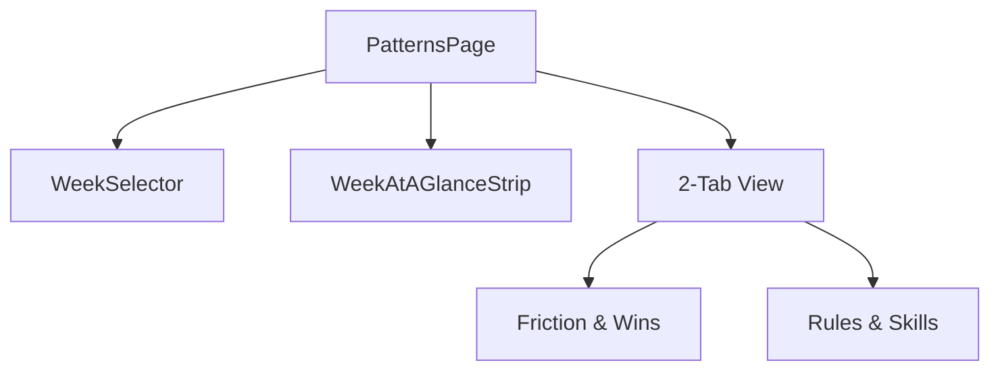
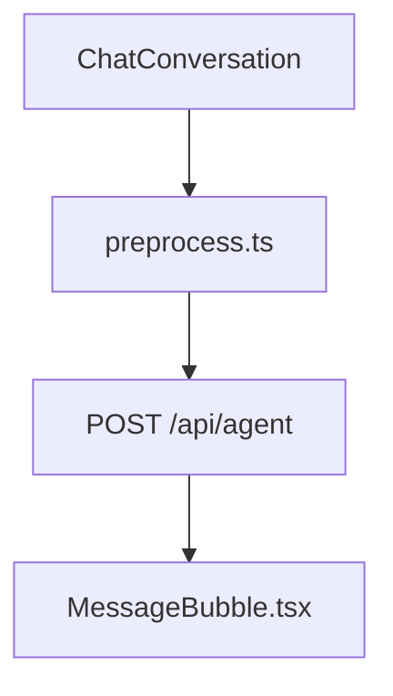

# Dashboard UI Component Architecture

> Component architecture, state management, and interaction flow for the Code Insights Dashboard. Linked from [Architecture](../architecture.md).

## Core Application Structure

The Dashboard is a React SPA built with Vite, TypeScript, and Tailwind CSS, featuring standard components from `shadcn/ui`.

```mermaid
flowchart TD
    App[App.tsx] --> Router[React Router]
    Router --> Layout[Dashboard Layout]
    Layout --> Sidebar[Navigation]
    Layout --> Pages[Page Components]
```

## Key Views & Component Trees

### Session Detail Views (`SessionDetailPage.tsx` & `SessionDetailPanel.tsx`)

The dashboard provides both a standalone full-page view (`/sessions/:id`) and an embedded panel component for analyzing session details.

```mermaid
flowchart TD
    SessionPage[SessionDetailPage.tsx] --> BackNav[Back to Sessions Link]
    SessionPage --> SessionDetail[SessionDetailPanel.tsx]
    SessionDetail --> VitalsStrip[VitalsStrip]
    SessionDetail --> AnalysisCostLine[AnalysisCostLine]
    SessionDetail --> ActionsMenu[Actions Dropdown Menu]
    ActionsMenu --> ExportRails[Export Rails JSON]
    ActionsMenu --> ExportFca[Export FCA Matrix CSV]
    SessionDetail --> SessionTimeline[SessionTimeline]
    SessionDetail --> InsightCards[InsightCards]
    SessionDetail --> FcaMatrixCard[FcaMatrixCard.tsx]
    SessionPage --> FcaMatrixContainer[Full-width FcaMatrixCard]
```

- **`SessionDetailPage`**: Dedicated full-page route at `/sessions/:id` featuring top back navigation (`ArrowLeft` ghost button) and responsive containers for session vitals, timeline, insight cards, and FCA matrix exploration.
- **`SessionDetailPanel`**: Container component orchestrating data fetching (`useSession`) and state. Provides the session dropdown menu with quick exports (`Export Rails JSON`, `Export FCA Matrix (CSV)`).
- **`VitalsStrip`**: Displays high-level session metrics (Duration, Prompts, Turn Count, AI Fluency Score) in a horizontal badge format.
- **`AnalysisCostLine`**: Visualizes token consumption and LLM API cost using `useAnalysisUsage` to provide per-session economic visibility.

### Formal Concept Analysis (FCA) Incidence Matrix (`FcaMatrixCard.tsx`)

Visualizes the session's semantic episode milestones against 10 binary Formal Concept Analysis attributes $(G, M, I)$ for concept lattice derivation.

- **Grouped Categories**:
  - **Decision Drivers (3)**: `LLM_Decide` (agent-led), `User_Decide` (user-directed), `Collab_Decide` (co-designed).
  - **Target Scope (4)**: `Target_Config`, `Target_SrcCode`, `Target_Test`, `Target_Docs`.
  - **Outcome State (3)**: `State_Success`, `State_Error`, `State_Blocked`.
- **Interactive UX**: Two-tier header, column tooltips with formal attribute definitions, emerald checkmark indicators for positive incidence ($gIm$), and subtle center dots for non-incidence.
- **Direct Downloads**: Action buttons for instant downloading of `session-${id}-fca.csv` and `session-${id}-rails.json` with toast feedback and disabled states during download.

### Decision Cards & Attribution Badges (`insight-metadata.tsx`, `InsightCard.tsx`)

Decision insight cards render structured attribution and architectural branching points:
- **`DecidedByBadge`**: Prominent driver badge with color coding:
  - **User** (`User` icon): Blue badge (`bg-blue-500/10 text-blue-600 border-blue-500/20`).
  - **Agent** (`Bot` icon): Purple badge (`bg-purple-500/10 text-purple-600 border-purple-500/20`).
  - **Collaborative** (`Users` icon): Emerald badge (`bg-emerald-500/10 text-emerald-600 border-emerald-500/20`).
- **Initiating Intent**: Indigo target icon displaying the user requirement or overarching goal behind the decision.
- **Branch Point**: Amber split icon highlighting the critical alternative design path branched away from.

### Patterns Page (`PatternsPage.tsx`)

Cross-session synthesis for uncovering larger trends.

```mermaid
flowchart TD
    PatternsPage[PatternsPage] --> WeekSelector[WeekSelector]
    PatternsPage --> WeekAtAGlanceStrip[WeekAtAGlanceStrip]
    PatternsPage --> Tabs[2-Tab View]
    Tabs --> Tab1[Friction & Wins]
    Tabs --> Tab2[Rules & Skills]
```

- **Threshold Gates**: Requires a minimum number of valid sessions before generating weekly patterns to avoid low-confidence outputs.
- **SSE Streaming**: Generates patterns in real-time, streaming text to the UI as it reflects on the week's data.
- **`WeekAtAGlanceStrip`**: A concise summary of the week's overall characteristics, used as the primary source for generating social sharing cards (`share-card-utils.ts`).

### Journal Page (`JournalPage.tsx`)

Chronological timeline of insights.

- Integrates `useInsights` for fetching parsed insights.
- Utilizes `date-fns` to intelligently group and format learnings, decisions, and outcomes by ISO week.
- Supports detailed timeline filtering.

### Chat Subsystem (`ChatConversation.tsx`)

A unified chat interface for deep dives into session data.

```mermaid
flowchart TD
    ChatConversation[ChatConversation] --> Preprocess[preprocess.ts]
    Preprocess --> API[POST /api/agent]
    API --> MessageBubble[MessageBubble.tsx]
```

- **`preprocess.ts`**: Sanitizes and structures user inputs, ensuring context references are cleanly parsed before they hit the LLM.
- **`POST /api/agent`**: Receives preprocessed input. Handles strict schema validation and responds with standard RLM (Run Language Model) responses.
- **`MessageBubble.tsx`**: Rich rendering for chat responses. Interprets structured outputs like tool calls, code diffs, or markdown tables.

## State Management

- **React Query**: Handles all server interactions (`useSessions`, `useAnalysisQueue`, `useInsights`). Caches are intelligently invalidated (e.g., when the Analysis Queue drains).
- **Context API**: For global theme and settings management.
