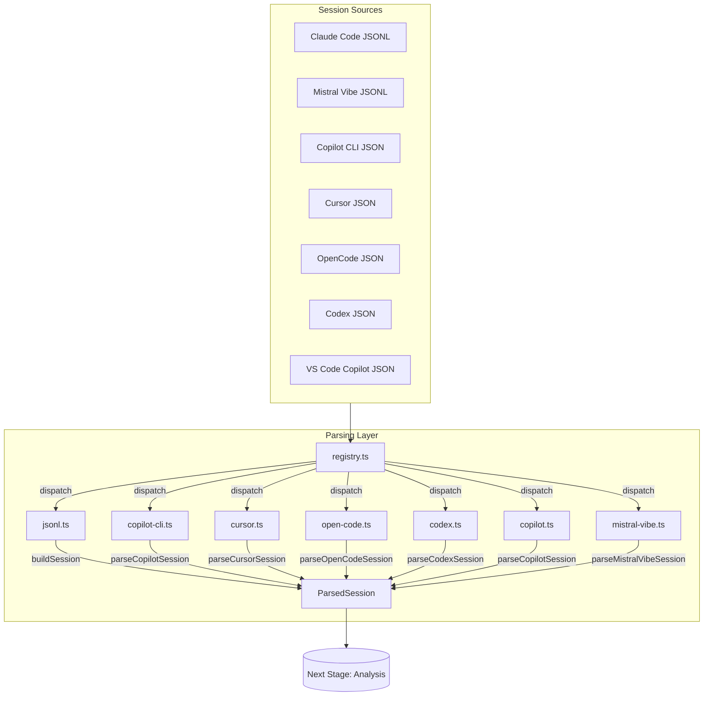

# Parsing Layer Module

> Transformation contract for session file parsing and normalization

## Transformation Contract

**Input**: Raw session files in various formats (JSONL, native formats)
**Process**: Parse → Extract → Normalize → Validate
**Output**: `ParsedSession` - unified session data structure

## Overview

The Parsing Layer is responsible for reading session files from multiple AI assistant providers and converting them into a common `ParsedSession` format for consistent processing.

## Supported Providers

| Provider | File Format | Parser | Status |
|----------|-------------|--------|--------|
| Claude Code | JSONL | `jsonl.ts` | ✅ Active |
| Mistral Vibe | JSONL | `jsonl.ts` | ✅ Active |
| Copilot CLI | JSON | `copilot-cli.ts` | ✅ Active |
| Cursor | JSON | `cursor.ts` | ✅ Active |
| OpenCode | JSON | `open-code.ts` | ✅ Active |
| Codex | JSON | `codex.ts` | ✅ Active |
| Copilot (VS Code) | JSON | `copilot.ts` | ✅ Active |

## Architecture



## Key Files

| File | Responsibility | Community | Nodes |
|------|---------------|-----------|-------|
| `jsonl.ts` | JSONL file parsing | jsonl.ts | 27 |
| `registry.ts` | Provider registry and dispatch | registry.ts | 16 |
| `copilot-cli.ts` | Copilot CLI parser | copilot-cli.ts | 9 |
| `cursor.ts` | Cursor parser | cursor.ts | 17 |
| `mistral-vibe.ts` | Mistral Vibe parser | mistral-vibe.ts | 4 |
| `codex.ts` | Codex parser | codex.ts | 18 |
| `copilot.ts` | VS Code Copilot parser | copilot.ts | 9 |
| `titles.ts` | Session title generation | generateTitle | 8 |

## Core Data Structures

### ParsedSession

The unified session structure:

```typescript
interface ParsedSession {
  sessionId: string;
  provider: ProviderType;
  projectName: string;
  projectPath: string;
  messages: ParsedMessage[];
  metadata: SessionMeta;
  timestamp: Date;
  character: string;
  // Computed fields
  duration?: number;
  tokenCount?: number;
}
```

### ParsedMessage

```typescript
interface ParsedMessage {
  id: string;
  role: 'user' | 'assistant' | 'system' | 'tool';
  content: string;
  timestamp?: Date;
  metadata?: MessageMeta;
  toolCalls?: ParsedToolCall[];
  toolResults?: ParsedToolResult[];
}
```

### ProviderType

```typescript
type ProviderType = 
  | 'claude-code'
  | 'mistral-vibe'
  | 'copilot-cli'
  | 'cursor'
  | 'open-code'
  | 'codex'
  | 'copilot';
```

## Core Functions

### buildSession()

**Location**: `cli/src/parser/jsonl.ts`

**Purpose**: Parse JSONL file and build ParsedSession

**Transformations**:
1. Read and parse JSONL file
2. Extract session metadata
3. Parse each message
4. Classify message types
5. Extract tool calls and results
6. Generate session title

**Signature**:
```typescript
function buildSession(
  filePath: string,
  options?: ParseOptions
): ParsedSession
```

### parseCopilotSession()

**Location**: `cli/src/parser/copilot-cli.ts`

**Purpose**: Parse Copilot CLI session JSON

**Transformations**:
1. Parse Copilot CLI JSON format
2. Extract session metadata from Copilot structure
3. Normalize messages
4. Handle Copilot-specific fields

### parseCursorSession()

**Location**: `cli/src/parser/cursor.ts`

**Purpose**: Parse Cursor IDE session JSON

**Transformations**:
1. Parse Cursor JSON format
2. Extract lexical text from messages
3. Extract file paths from bubbles
4. Normalize to ParsedSession

### generateTitle()

**Location**: `cli/src/parser/titles.ts`

**Purpose**: Generate human-readable session title

**Strategy**:
1. Extract first user message
2. Remove code and special characters
3. Truncate to reasonable length
4. Add context from project name

**Special Handling**:
- Bash/shell execution tools get special labels
- Code-related sessions include file info
- Generic sessions use first message preview

## Provider-Specific Parsing

### JSONL Providers (Claude Code, Mistral Vibe)

Common format:
```json
{
  "id": "session-id",
  "type": "message",
  "role": "user" | "assistant",
  "content": [{"type": "text", "text": "..."}],
  "timestamp": "2026-08-10T00:00:00Z"
}
```

### Copilot CLI Format

```json
{
  "session_id": "...",
  "messages": [
    {
      "id": "...",
      "role": "user" | "assistant",
      "content": "...",
      "timestamp": "..."
    }
  ]
}
```

### Cursor Format

```json
{
  "id": "...",
  "bubbles": [
    {
      "id": "...",
      "role": "user" | "assistant",
      "message": "...",
      "metadata": {...}
    }
  ]
}
```

## Message Classification

### classifyUserMessage()

**Location**: `cli/src/parser/jsonl.ts`

**Purpose**: Classify user messages for better categorization

**Categories**:
- `command` - CLI/shell commands
- `question` - Questions to AI
- `code` - Code-related requests
- `feedback` - User feedback
- `other` - General messages

### extractSessionId()

**Location**: `cli/src/parser/jsonl.ts`

**Purpose**: Extract session ID from various file formats

**Patterns**:
- Direct `id` field
- `session_id` field
- Filename-based extraction

### extractProjectName()

**Location**: `cli/src/parser/jsonl.ts`

**Purpose**: Extract project name from session metadata

**Sources**:
- Explicit project field
- Path parsing
- Heuristic detection

## Tool Call Parsing

### ParsedToolCall

```typescript
interface ParsedToolCall {
  id: string;
  name: string;
  arguments: Record<string, unknown>;
  type: 'function' | 'code_interpreter';
}
```

### ParsedToolResult

```typescript
interface ParsedToolResult {
  id: string;
  toolCallId: string;
  content: string;
  isError: boolean;
}
```

## Validation

### Session Validation

Each parsed session is validated for:
1. Required fields present
2. Valid provider type
3. Message structure correctness
4. Timestamp validity
5. Content length limits

### Error Handling

Invalid sessions are:
1. Logged for debugging
2. Skipped (not processed)
3. Reported in sync results

## Performance Considerations

1. **Streaming Parsing**: Large files parsed incrementally
2. **Parallel Processing**: Multiple files parsed concurrently
3. **Memory Efficiency**: Minimal in-memory retention
4. **Caching**: File hashes used to skip re-parsing

## Testing

Tests located in:
- `cli/src/parser/__tests__/`

Key test files:
- Tests for each provider parser
- Message classification tests
- Tool call extraction tests

---

*Generated by graphify + codebase-mapper. Last updated: 2026-08-10*
